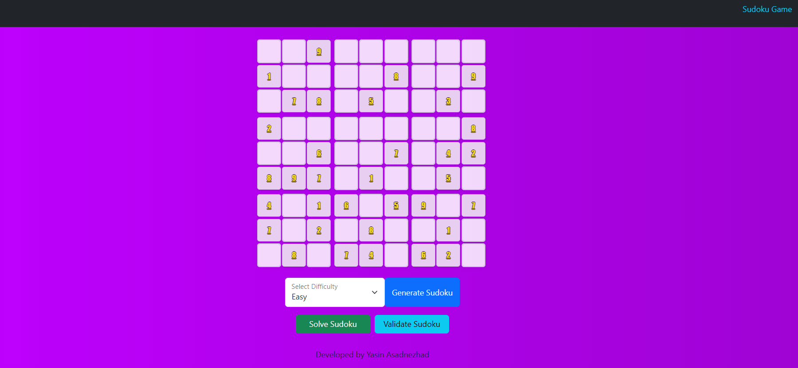

# Sudoku Game in Angular

An Angular 18 Sudoku application that generates boards from the Sugoku API, lets players inspect and fill empty cells, validates the current puzzle state, and can request a full solution from the same API.

This project is built with standalone Angular components, SCSS styling, Bootstrap-based layout utilities, toast notifications, and a lightweight loading skeleton while a board is being fetched.

## Preview



## Features

- Generate Sudoku boards by difficulty: `easy`, `medium`, `hard`, or `random`
- Render a 9x9 grid with visual 3x3 section spacing
- Restrict empty-cell input to digits `1` through `9`
- Validate a board through the remote Sudoku API
- Solve the current board through the remote Sudoku API
- Show toast notifications for success, warning, info, and error states
- Display skeleton placeholders while loading a puzzle

## Tech Stack

- Angular 18
- TypeScript
- SCSS
- Bootstrap 5
- `ngx-toastr`
- `ngx-skeleton-loader`
- External Sudoku API: `https://sugoku.onrender.com`

## Project Structure

```text
src/
	app/
		components/
			footer/          Shared footer
			header/          Shared header
			layout/          Application shell
			sudoku-game/     Main Sudoku UI and interactions
		directives/
			valid-sudoku-number.directive.ts   Input restriction for Sudoku cells
		models/
			sudoku.model.ts  Shared types and API contracts
		services/
			sudoku.service.ts   API integration for board/validate/solve
```

## How It Works

### Board generation

When the app loads, it immediately requests an `easy` board from the Sugoku API. Users can switch difficulty and generate a new puzzle at any time.

### Validation

The Validate action sends the current board to the remote `/validate` endpoint and displays one of these states:

- `solved`: the puzzle is valid and complete
- `broken`: the puzzle is not complete yet according to the current implementation messaging

### Solving

The Solve action sends the current board to the remote `/solve` endpoint. If a solution is returned with status `solved`, the UI replaces the current board with the solved one.

### Input handling

The custom `ValidSudokuNumberDirective` blocks invalid keyboard input, prevents `0`, and restricts pasted values to a single digit from `1` to `9`.

## Getting Started

### Prerequisites

- Node.js LTS version compatible with Angular 18
- npm

### Install dependencies

```bash
npm install
```

### Start the development server

```bash
npm start
```

Then open `http://localhost:4200` in your browser.

## Available Scripts

```bash
npm start     # Start the Angular dev server
npm run build # Create a production build in dist/
npm run watch # Rebuild on file changes using the development configuration
npm test      # Run unit tests with Karma
```

## Architecture Notes

- `SudokuGameComponent` is the main feature component and owns the board state, selected difficulty, and user actions.
- `SudokuService` wraps all HTTP calls to the external Sudoku API.
- `LayoutComponent` provides the shell with header, router outlet, and footer.
- The application uses standalone Angular components instead of NgModules.
- Toast notifications are configured globally in `app.config.ts`.

## Testing

The repository includes Angular unit test scaffolding for:

- the root app component
- the Sudoku game component
- the Sudoku service
- the custom input directive
- shared layout/header/footer components

Current tests are basic smoke tests and are a good starting point for expanding behavior coverage around board generation, form interaction, and service responses.

## Known Limitations

- The app depends on the availability of the hosted Sugoku API at `https://sugoku.onrender.com`.
- The UI renders editable inputs for empty cells, but user-entered values are not currently synchronized back into the in-memory `board` model. As a result, validate and solve requests operate on the generated board state rather than the visible user edits.
- Validation status messaging is limited to the API contract currently modeled in the frontend.

## Possible Improvements

- Bind empty-cell inputs directly to the board model
- Add highlighting for invalid rows, columns, or 3x3 regions
- Add puzzle reset and new-game confirmation flows
- Expand unit tests around HTTP interactions and board updates
- Add accessibility improvements for keyboard navigation and announcements

## Author

Developed by Yasin Asadnezhad.

## License

This project is licensed under the MIT License. See the `LICENSE` file for details.
